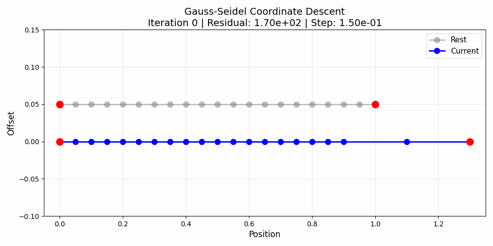
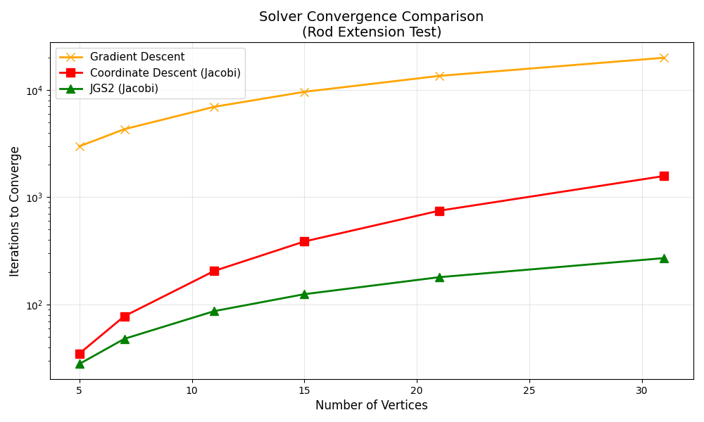
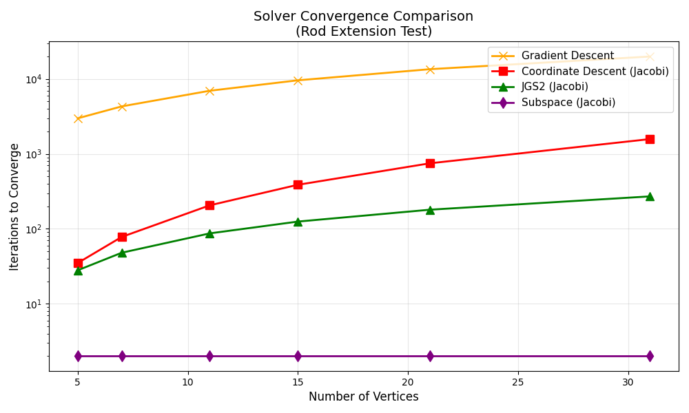

## 06-10-2025 Super Fast Solvers

<script>
  window.MathJax = {
    tex: {
      inlineMath: [['$', '$'], ['\\(', '\\)']],
      displayMath: [['$$', '$$'], ['\\[', '\\]']]
    },
    svg: { fontCache: 'global' }
  };
</script>

<script id="MathJax-script" async
  src="https://cdn.jsdelivr.net/npm/mathjax@3/es5/tex-svg.js">
</script>


Song of the week: [Things In Life](https://www.youtube.com/watch?v=O1p3wXe0MCw)

There has recently been a lot of fast solvers for physics based animation offering tremendeous speedups compared to more traditional. I wanted to talk about it because, while these methods present incredible results and the systems they build around them represent incredible feats of engineering, they often come a bit short in showing the "why" in why they get that speedup. Is it just impressive engineering, or is there something fundamental about their method that enables this speedup (I would argue it's a bit of both :)).

### Some Context: Optimization-based Integration
Before I throw all these awesome papers under the bus, I'd like to give some context. Lately in physics-based animation it's becoming normalized to take a "variational approach" in which each time step physics are advanced by solving a minimization:
$$
x^{t+1} = \arg\min_x E(x)
$$
where $x \in \mathbb{R}^{3n}$ are the $n$ vertex positions in in 3D, and $E(x)$ is some nonlinear energy function, which is typically a sum of a set of potentials (e.g. elastic, collision, inertial), and $x^{t+1}$ is the new vertex positions for the next time step. This is a very useful way to frame the problem, as it enables us to bring in tools from the optimization community. 

For these optimization problems we will usually design iterative algorithms which start at some initial guess $x^0$ for $x^{t+1}$. These methods typically look like:
```
x = xt # some initial guess
while not converged:
    d = search_direction(x) # compute some update to your x positions
    alpha = step_size(x, d) # compute a step size
    x = x + alpha * d

    if converged:
        break
return x
```

### Gradient Descent
So for example for the easiest case, gradient descent, we would have:
```
x = xt # some initial guess
step_size = 0.01 # some predetermined step size
while not converged:
    d = -gradient(x)
    x = x + step_size * d
    if ||d|| < tolerance:
        break
return x
```
Where here we just move along gradient directions, $-\nabla E(x)$ by some predetermined step size until the gradient is below some tolerance, indicating that we've converged to some local minimum of $E(x)$.

### Newton's Method
Well as we'd expect, gradient descent generally requires many iterations to converge, especially for the stiff problems we run into in elastic simulations. Gradient comes from linearizing the energy function around the guess at each step, so we are only locally solving a linear approximation to $E(x)$. Newton's method, instead solves a quadratic approximation to $E(x)$ at each step, resulting in a much faster convergence rate. The pseudocode for this looks like:
```
x = xt # some initial guess
while not converged:
    H = hessian(x)
    g = gradient(x)
    d = -H^-1 * g
    alpha = line_search(x, d)
    x = x + d
    if ||d|| < tolerance:
        break
return x
```
So that now the descent direction is computed by solving a linear system $Hd = -g$. Computing the inverse of the Hessian effectively solves for the "ideal" step size to multiply each entry of the gradient by (ideal in the sense that it minimizes the quadratic approximation to $E(x)$). This has the added cost though of now requiring Hessian evaluation and inverse at each step, which can be far too costly if we're looking for real-time performance.

Also in the above we use line search to determine the step size, which is a quick-and-dirty way to ensure that the steps we take are still reducing the energy. A second order method is still imperfect and especially for the kinda stiff problems in PBA, generally require line search for reliable convergence. Line search tries to find the optimal step size $\alpha$ to minimize the energy given our decent direction:
$$
\alpha = \arg\min_{\alpha} E(x + \alpha d)
$$
There's a few ways people do this, but let's not get into that, that's for another time ;).


Most algorithms for PBA will lie between these two extremes, and try to offer some tradeoff between per-iteration cost and overall convergence speed. I'm gonna assume here that you will accept my claim that gradient descent is very fast to compute per-iteration but slow to converge, and that Newton's method can be slow per-iteration but fast to converge. That's not too controversial, right? The big tricky bit with Newton's method is doing the inverse of the Hessian efficiently. There's loads of literature accelerating this, but that won't be the focus here. Here we're gonna look at a subset of the approaches that try to skirt around this by only using the Hessian for some subset of the coordinates.


## Coordinate Descent
In the past year or so there's been quite a lot of research on fast solvers that take a coordinate-descent-type approach to solving the optimization problem. Coordinate descent works by solving a different optimization problem, one for each (or a subset of) the coordinates in $x$. This can be done in a highly parallelizable way, and if you choose a small enough subset of coordinates, the per-coordinate solve cost can be suitable for a single thread in a GPU kernel. The ability for these methods to leverage GPUs is the big reason we've seen a lot of attention in these type of methods, and without a doubt have produced fast solvers for PBA.

So for example, if we have $x = [x_1, x_2, x_3]^T$, we can solve a set of optimization problems:
$$
x_1^{t+1} = \arg\min_{x_1} E(x_1, x_2^t, x_3^t)
$$
$$
x_2^{t+1} = \arg\min_{x_2} E(x_1^t, x_2, x_3^t)
$$
$$
x_3^{t+1} = \arg\min_{x_3} E(x_1^t, x_2^t, x_3)
$$
This is a Jacobi-like approach allowing us to solve for each coordinate independently. If we instead solve for them sequentially, replacing $x_i^t$ with $x_{i-1}^{t+1}$ we get a Gauss-Seidal-like approach. Some works do this instead. The Gauss-Seidel variant will yield better convergence, but is trickier to parallelize. The pseudocode for the Jacobi variant looks like:
```
x = xt # some initial guess
while not converged:
    d = zeros(n)
    xk = x
    for i in 1:n:
        H = hessian(xk, i)   # hessian of the energy function with respect to the i-th coordinate
        g = gradient(xk, i)  # gradient ...
        d[i] = -H^-1 * g
    x = x + d
    if ||d|| < tolerance:
        break
return x
```
Above we compute the update for each coordinate in a sequential order, and then add it to the current iterate. This is done in "sweeps" of the coordinates so that after a number of iterations, we should arrive at a solution that satisfies the original optimization problem.

## A Model Problem
So now we should have a rough grasp of some different ways to solve optimization time stepping in PBA. To do some basic evaluation, let's consider a simple model problem. A 1D elastic rod with fixed ends, and a prescribed displacement at one of the ends.

We a rod with $n$ vertices, and $n-1$ elements. Each element has a length $l_i$ and a stiffness $k_i$. We define a deformation gradient $F_i$ for each element as:

$$
F_i = \frac{x_{i+1} - x_i}{X_{i+1} - X_i}
$$

where $x_i$ is the position of the $i$-th vertex, and $X_i$ is the initial position of the $i$-th vertex. This describes the deformation of a segment relative to its initial length. With $F$ we can define the elastic energy density for each element as:

$$
\Psi_i = \frac{1}{2} k_i (F_i - 1)^2
$$

where $k_i$ is the stiffness of the $i$-th element. The total energy for the rod is then:

$$
E(x) = \sum_{i=1}^{n-1} \Psi_i
$$

Note that here the energy is quadratic in $x$, so the exact solution to our optimization problem is

$$
x = x_0 + H^{-1} g
$$

where $H$ is the Hessian of the energy, and $g$ the gradient. With Newton's being a second order method, it finds a solution in one iteration. This is what the solution to a prescribed rigthward displacement on the right end of the rod looks like:

<p align="center">
  
</p>

Pretty simple. The "Rest" line shows the initial configuration of the rod (the $X$ positions). The "Deformed" line shows the final configuration of the rod (the $x$ positions) after the solve. The red dots show the fixed ends of the rod.

 Let's first look at gradient descent plus coordinate descent Jacobi and Gauss-Seidel variants.
 
 <p align="center">
  
</p>
Here we see the number of iterations require to converge to a set tolerance of $10^{-6}$ as we increase the number of vertices in the rod. We see that the number of iterations scales linearly with the number of vertices.

The time to converge for each of these methods is related to the number of vertices as they all essentially do local work per-iterate. The initial gradient is large and on a single vertex at the right end, and the optimization algorithms will essentially have to propogate this gradient to the left end of the rod. You can see this sort of message passing effect when visualizing the coordinate descent progress:
<p align="center">
  
</p>
Note how the displacements propogate quickly near the right end, but many iterations are needed to evenly distribute the displacements across the rod. 

## Something Better?
Recently a paper called [JGS2 (Lan et al. 2025)](https://arxiv.org/abs/2506.06494) made a similar observation about these local methods. They largely target an effect they call "overshooting" in which local coordinate descent methods overshoot due to lack of awareness of the problem stiffness outside of the neighborhood of a single coordinate. They follow a similar coordinate descent approach in which for each coordinate they construct a subspace corresponding to displacement that would occur to a perturbation of the coordinate, keeping all others fixed. As a precomputation step, for each vertex they solve a block system of the form:

$$
\begin{bmatrix}
H_{ii} & H_{ic} \\
H_{ic}^T & H_{cc}
\end{bmatrix}
\begin{bmatrix}
I \\
U_{ic}
\end{bmatrix}
=
\begin{bmatrix}
\delta F_i \\
0
\end{bmatrix}
$$

where $I$ is the identity matrix corresponding to the DOFs for a single coordinate, $H_{ii}$ is the Hessian of the energy function with respect to the $i$-th coordinate, $H_{cc}$ is the Hessian of the energy function with respect to the *complementary* DOFS (all DOFs except the $i$-th), and $H_{ic}$ is the Hessian of the energy function with respect to the $i$-th coordinate and the *complementary* DOFS. $U_{ic}$ is the basis for the subspace of displacements that would occur to a unit perturbation of the $i$-th coordinate, $\delta F_i$ is the virtual force corresponding to this perturbation. 

From this system they build a per-coordinate subspace basis $U_i = -H_{cc}^{-1} H_{ic}^T \in \mathbb{R}^{n-1}$. Let's visualize this basis on our model problem:
<p align="center">
  
</p>
Here we see the perturbation basis for three vertices in this rod. So we can see this recovers a solution to our problem given prescribed displacements at each vertex and (0 at the fixed ends in this case to make sure the bases are compatible with our original problem's boundary conditions). They then use this basis to update the per-coordinate solve to include the stiffness and gradient contributions from the complementary displacement basis. Their per-coordinate solve is then:

$$
\delta x_i = (H_{ii} + U_{ic}^T H_{cc} U_{ic})^{-1} (g_i + U_{ic}^T g_c)
$$

where $g_c$ is the gradient of the energy function with respect to the *complementary* DOFS, and the other terms are as defined above. Let's see how the Jacobi variant of JGS2 performs in our model problem, compared to Gradient and Coordinate (Jacobi) descent:
<p align="center">
  
</p>
This looks a bit better, but the overall convergence rate is still similar to coordinate descent. 

## Something Even Better?

JGS2 is a good improvement, but there is still clear room for better convergence. JGS2's displacement equation makes an assumption that the displacement of the complementary DOFS matches the displacement of the complementary DOFs from the unit perturbation. Therefore this can excessively dampen the displacements if the expected displacement of the individual DOFs is far from a unit perturbation. If we instead modify this and solve for both the complementary subspace's displacement plus the individual DOF's displacement this would basically give us "optimal" magnitude of dampening (solver will control the amplitude of the complementary displacement).

This can be done by instead solving the coupled block system:

$$
\begin{bmatrix}
H_{ii} & H_{ic} U_{ic} \\
U_{ic}^T H_{ic}^T & U_{ic}^T H_{cc} U_{ic}
\end{bmatrix}
\begin{bmatrix}
\delta x_i \\
\delta x_c
\end{bmatrix}
=
-\begin{bmatrix}
g_i \\
U_{ic}^T g_c
\end{bmatrix}
$$

Solving first for 

$$
\delta x_c = -\tilde{H}_{cc}^{-1}(U_{ic}^T g_c + U_{ic}^T H_{ic}^T \delta x_i),
$$ 

where $\tilde{H}_{cc} = U_{ic}^T H_{cc} U_{ic}$, and substituting this into the first equation gives us:

$$
\delta x_i = -(H_{ii} - H_{ic} U_{ic} \tilde{H}_{cc}^{-1} U_{ic}^T H_{ic}^T)^{-1} (g_i - H_{ic} U_{ic} \tilde{H}_{cc}^{-1} g_c)
$$

This is essentially the same cost as the JGS2, but with the correct substiutions to account for varying subspace contributions. The resulting method performs a schur-complement solver for each coordinate, and is called "Subspace (Jacobi)".

<p align="center">
  
</p>

Here we see the number of iterations to converge is 1 in our new method. This is expected as the problem we're solving is quadratic, so the subspace we're using is "optimal" in this case.